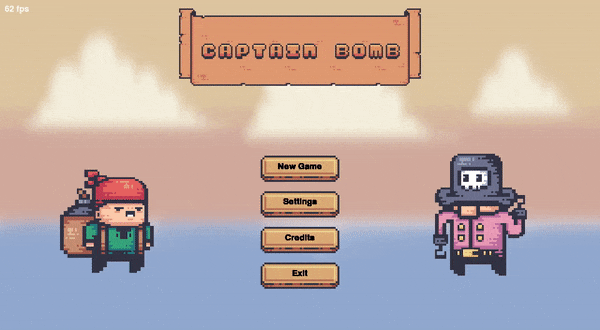
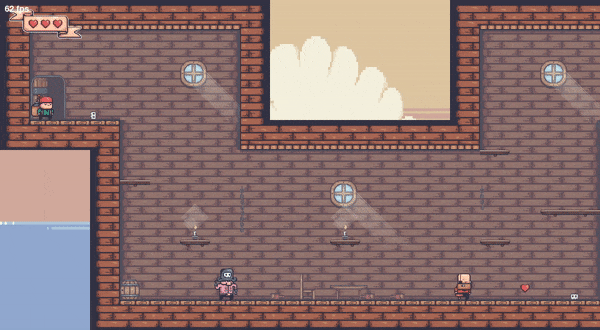
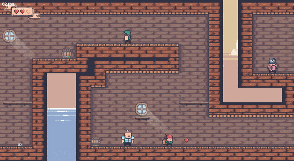

# **🎮 Captain Bomb 💣**

## Description 📜

Captain Bomb is a simple platform game written in `Python3` using the `pygame` library.

## Gallery 📷

<p align="center">
  
</p>

<p align="center">
  
</p>

<p align="center">
  
</p>

## Usage ⚙️

To run the game you need to install the `pygame` library. This can be done with the following command:

```cmd
pip install pygame

```

Once `pygame` is installed, you should be able to run the game using the following command in the directory containing the `main.py` file:

```cmd
python3 main.py

```

## Graphics used in project 🎨

[Pirate Bomb](https://pixelfrog-assets.itch.io/pirate-bomb) - [Pixel Frog](https://pixelfrog-assets.itch.io/) 🐸

## License 📄

[MIT License](LICENSE)